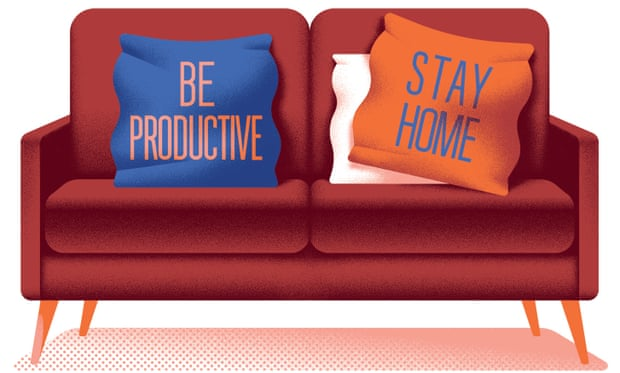

# The best thing you can do to make the world a better place? 
## Sometimes the answer is nothing

Don’t be fooled into overachieving – it’s often more valuable to simply not screw things up.

Lots of people are feeling unproductive,” the doctor and journalist James Hamblin observed last month. “But if you successfully infect zero people with the virus, seriously, you’ve been extremely productive.”

It has been a strange truth about the pandemic that for most of us, most of the time, the single most important thing we’ve been called upon to do, for our own benefit and that of others, has been not to do things: stay home, avoid crowds, go shopping as infrequently as possible, refrain from coughing or sneezing on people, and so on. For a civilisation fixated on getting stuff done, this was never going to be easy. The energy of the global anti-racism protests has been attributed, in part, to people feeling cooped up in lockdown. But maybe a better way to put that is that finally, after months of compulsory nothing, there was something tangible to be done.

The more I thought about Hamblin’s underlying point, though – that not doing things can sometimes be worth feeling good about – the more I wondered why it only applied to not spreading germs. After all, don’t I refrain from doing a theoretically infinite number of things every day, and by so (not) doing, make the world better than otherwise? We’re familiar with this idea of abstention as a virtue in certain specific contexts: in the medical vow to “do no harm”, for example; or frugality as abstention from unnecessary spending; or sobriety as abstention from alcohol. But what about all the times I don’t snap at my partner or son, or the Twitter feuds I don’t get embroiled in? What about all the meat I don’t eat, despite not being vegetarian, or the greenhouse gas emissions I don’t cause? And put aside, for a moment, all those times I succumb to digital distraction when I ought to be working; what about all the times I don’t succumb?

If this strikes you as a suspiciously simple intellectual trick that probably won’t eliminate everyone’s stress and anxiety for ever, well, I’d have to agree. Obviously, there are countless things I don’t do for which I don’t deserve praise: not murdering people, not vandalising storefronts, not defrauding animal welfare charities in order to buy sports cars and cocaine, the list goes on. Besides, plenty of the stress we feel about getting things done is because we genuinely do need to get them done, simply to stay financially afloat.

Even so, I think there’s a liberating insight here for all of us who go through life with the background conviction that our moral worth is defined by our accomplishments, that we must earn our right to exist by achieving some minimum standard of performance at work, as parents, or in some other realm, and that we’re fundamentally bad people if we don’t. Ideally, we’d just drop that whole notion and be at peace with ourselves, whatever our performance. But that’s a hard task – the task of a lifetime, perhaps.

In the meantime, we could at least start measuring our impact on the world a bit more objectively. Which means paying attention to the myriad ways in which we could potentially screw things up, every hour of every day, and yet somehow – wonderfully, exhilaratingly – do not.
